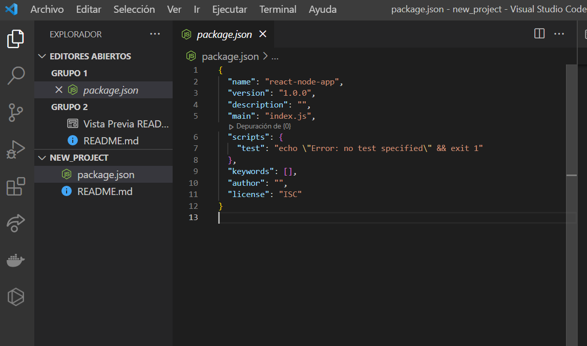
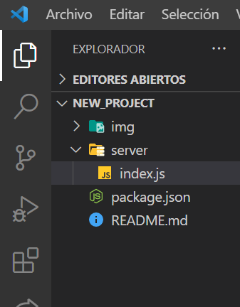
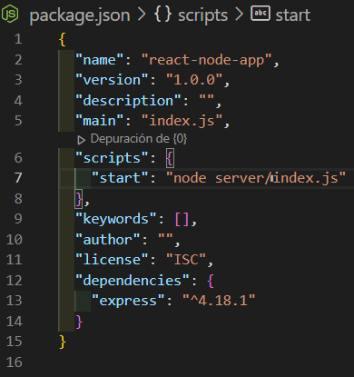
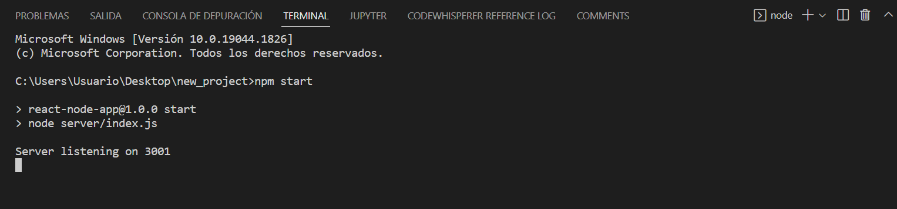
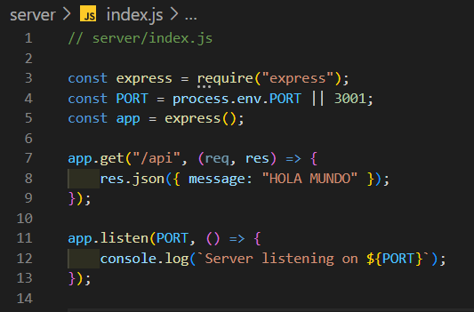

# Creación de un backend con Node

Vamos a crear un backend con Node y un servidor utilizando Express (todo esto lo vamos a hacer utilizando el sistema operativo Windows).

### ¿Qué es lo que vamos a necesitar?
* Editor de texto: se puede elegir el que a uno más le guste, en mi caso voy a usar Visual Studio Code.
* Node instalado en nuestra computadora.

## Inicio:
Para empezar crearemos una carpeta nueva en el escritorio (Desktop), para ello vamos a apretar las teclas **windows + r**, se nos abrirá la pantalla "Run Command" (comando ejecutar) y en el vamos a escribir **cmd** y presionaremos la tecla **Enter**. Se ejecutará nuestra terminal la cual mostrará algo como lo siguiente:

    C:\Users\Usuario>

En este punto voy a elegir mi escritorio y allí crearé mi carpeta nueva, para posicionarnos en el escritorio lo haremos utilizando el comando **cd + nombre_de_la_carpeta**:

    C:\Users\Usuario>cd Desktop

Para crear nuestra carpeta, a la que llamaremos new_project, usaremos el comando **mkdir + nombre_de_la_carpeta_a_crear**:

    C:\Users\Usuario\Desktop>mkdir new_project

Luego nos moveremos hacia nuestra carpeta recién creada:

    C:\Users\Usuario\Desktop>cd new_project

Y abriremos esta carpeta en Visual Studio Code, para ello escribiremos lo siguiente:

    C:\Users\Usuario\Desktop\new_project>code .

El comando **code .** se utiliza para abrir con Visual Studio Code, la carpeta en la que estamos posicionados.

Una vez que nuestra carpeta se ha abierto, de nuevo nos posicionamos en nuestra terminal que ya teníamos abierta y colocamos el siguiente código **npm init -y**:

    C:\Users\Usuario\Desktop\new_project>npm init -y

Esto nos creará un archivo **package.json** el cual nos va a mostrar todos los scripts y dependencias de nuestra app:

Ahora crearemos una carpeta, nos dirigimos a la esquina lateral izquierda de nuestro Visual Studio Code (VSC), a la parte del explorador de archivos en donde se lee **NEW_PROJECT**, al posicionarnos sobre esa carpeta a la derecha de la misma aparecerán varias opciones, entre las que se encuentra una que dice **Nueva carpeta**, clickeamos allí y en la ventana que se nos abre escribiremos **server**. Con esto creamos una nueva carpeta, ahora, nuevamente vamos a la esquina lateral izquierda de nuestro VSC, nos posicionamos sobre la carpeta recién creada y clickeamos el botón derecho de nuestro mouse, se nos abrirá una pequeña ventana, elegiremos la opción **Nuevo archivo** y escribiremos lo siguiente **index.js**. Todo lo anterior se verá así:

Vamos a usar Express y crearemos un servidor simple el cual correrá en el puerto 3001.

Para ello lo primero que vamos a hacer es instalar Express, vamos a nuestra terminal y escribimos lo siguiente:

    npm i express

Con este comando estaremos instalando Express como una dependencia que vamos a utilizar en nuestro proyecto.

Ahora pegaremos las siguientes líneas de código dentro de nuestro archivo **index.js** recién creado:

    // server/index.js

    const express = require("express");
    const PORT = process.env.PORT || 3001;
    const app = express();
    app.listen(PORT, () => {
        console.log(`Server listening on ${PORT}`);
    });

En nuestro archivo package.json, que se encuentra en VSC, colocaremos lo siguiente **"start": "node server/index.js"**, quedandonos así:

Ahora podemos correr nuestra aplicación usando el comando **npm start** en nuestra terminal de Visual Studio Code (VSC) o desde la terminal que ya tenemos abierta:

    C:\Users\Usuario\Desktop\new_project>npm start

Podemos abrir una terminal en Visual Studio (VSC) Code de 2 formas:

1. En la barra superior de nuestro VSC presionamos la pestaña que dice **Terminal**, en la ventana que se expande presionamos **Nuevo terminal** y se nos abre la terminal.

2. La segunda opción es apretar las teclas **ctrl + Mayús + ñ**.

En nuestra terminal se verá lo siguiente:

Y si vamos a nuestro navegador y en la barra de direcciones escribimos **localhost:3001** en pantalla nos saldrá lo siguiente: **Cannot GET /**.
***
Usaremos nuestro servidor como una API, haremos una petición simple para poderla ver en pantalla y enviaremos un mensaje, en este caso, HOLA MUNDO! en formato de objeto JSON.

Para ello vamos a nuestro archivo **index.js** y escribiremos lo siguiente **app.get("/api", (req, res) => {res.json({message: "HOLA MUNDO!"})});**:

Vamos a nuestra consola y cortamos la ejecución del back, para ello apretamos la siguiente combinación de teclas **Ctrl + c**. Una vez cortada la ejecución la volvemos a correr, escribiendo nuevamente **npm start** y presionando la tecla **Enter**.

Para corroborar que todo está funcionando bien, nos dirigimos a nuestro navegador y en la barra de búsqueda colocamos lo siguiente **localhost:3001/api**.

La pantalla de nuestro navegador mostrará lo siguiente:

    {
        message: "HOLA MUNDO"
    }

Esto significa que nuestro servidor funciona correctamente, a celebrar 💪🏼!!!